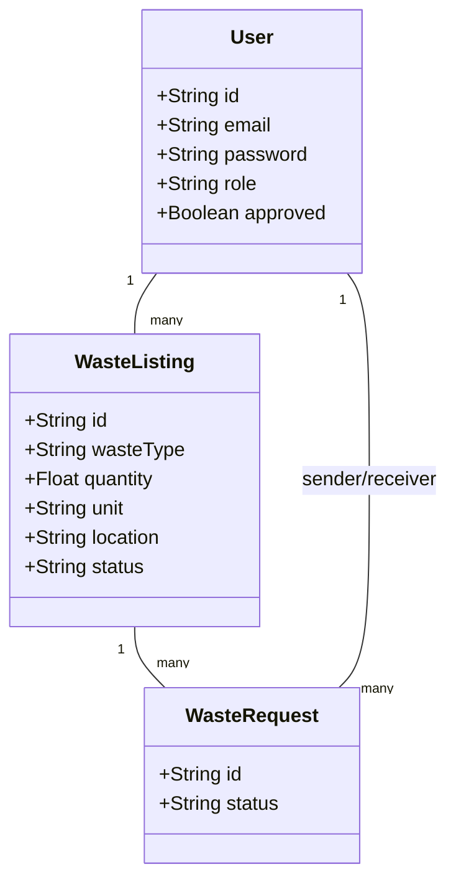

# 02 - Class Diagram

Class diagram (high level) for main domain objects.

```mermaid
classDiagram
  class User {
    +String id
    +String email
    +String password
    +String role
    +Boolean approved
  }

  class WasteListing {
    +String id
    +String wasteType
    +Float quantity
    +String unit
    +String location
    +String status
  }

  class WasteRequest {
    +String id
    +String status
  }

  User "1" -- "many" WasteListing
  WasteListing "1" -- "many" WasteRequest
  User "1" -- "many" WasteRequest : sender/receiver
```
