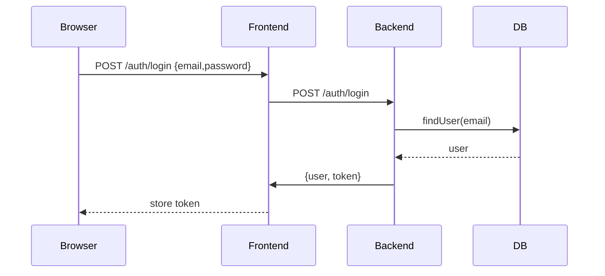
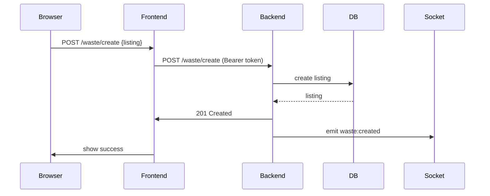

# 03 - Sequence Diagrams

Example: Login flow and Create Listing flow.

```mermaid
sequenceDiagram
  participant Browser
  participant Frontend
  participant Backend
  participant DB

  Browser->>Frontend: POST /auth/login {email,password}
  Frontend->>Backend: POST /auth/login
  Backend->>DB: findUser(email)
  DB-->>Backend: user
  Backend->>Frontend: {user, token}
  Frontend-->>Browser: store token
```

```mermaid
sequenceDiagram
  Browser->>Frontend: POST /waste/create {listing}
  Frontend->>Backend: POST /waste/create (Bearer token)
  Backend->>DB: create listing
  DB-->>Backend: listing
  Backend->>Frontend: 201 Created
  Backend->>Socket: emit waste:created
  Frontend->>Browser: show success
```
