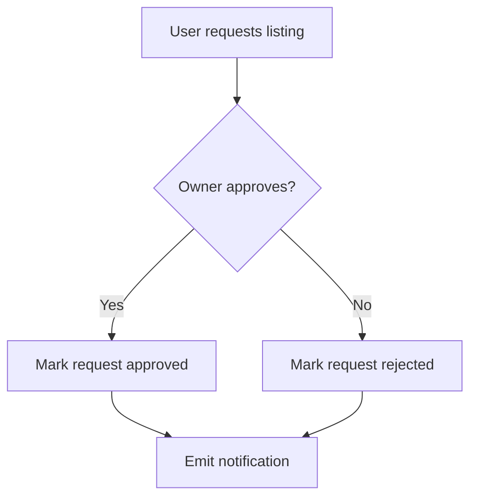

# 04 - Activity Diagrams

Example: Request Approval activity

```mermaid
flowchart TD
  A[User requests listing] --> B{Owner approves?}
  B -- Yes --> C[Mark request approved]
  B -- No --> D[Mark request rejected]
  C --> E[Emit notification]
  D --> E
```