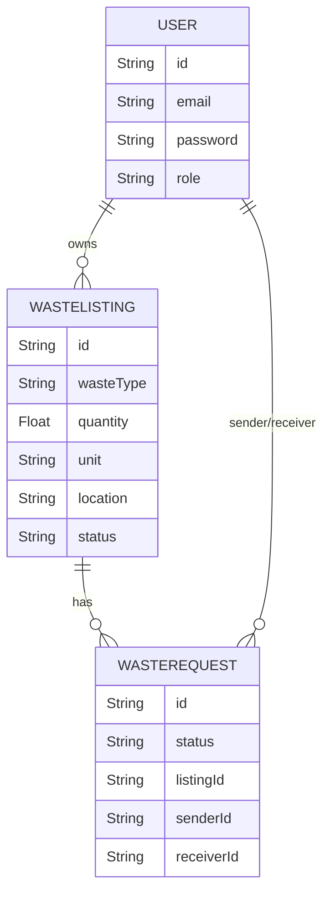

# 06 - ER Diagram

Derived from `backend/prisma/schema.prisma` (simplified):

```mermaid
erDiagram
  USER ||--o{ WASTELISTING : owns
  WASTELISTING ||--o{ WASTEREQUEST : "has"
  USER ||--o{ WASTEREQUEST : "sender/receiver"

  USER {
    String id
    String email
    String password
    String role
  }

  WASTELISTING {
    String id
    String wasteType
    Float quantity
    String unit
    String location
    String status
  }

  WASTEREQUEST {
    String id
    String status
    String listingId
    String senderId
    String receiverId
  }
```
