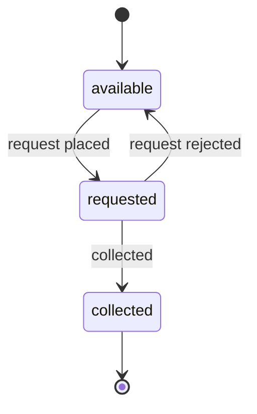

# 07 - State Diagram

Example state machine for a WasteListing:

```mermaid
stateDiagram-v2
  [*] --> available
  available --> requested : request placed
  requested --> collected : collected
  requested --> available : request rejected
  collected --> [*]
```
